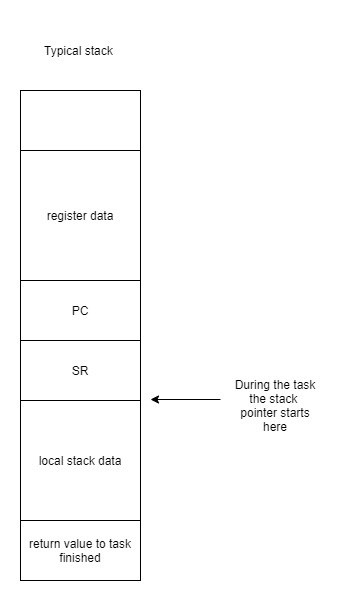

# BayertRTOS
This is a simple realtime operating system for the MSP430 microcontroller. 

## System Features
 * Preemptive operating system
 * Ability to create tasks on the fly.
 * All register data is saved and restored between tasks.
 * Seperate stacks for each task.
 * Memory management

## Getting Started
 Import the lib files into your project. And then in your main file use the import the RTOS.h file.
 ```c
 #include "RTOS.h"
 ```

## Public Functions

 * RTOS Setup

Sets up the RTOS system. This must be done only once before the system starts

```c
RTOSsetup(void);
```

 * RTOS init Task
 
RTOSinitTask sets up a task that will be run. This function adds a task to RTOS. This can be done while the RTOS is running, so a task can create another task. Returns -1 is it could not add a task because there was an error or the system already reaches the mask stacks. Otherwise returns a process id.

 ```c
 int process_id = RTOSinitTask(void (*pFun)(void));
 ```
 
 * RTOS Run

Runs all tasks. Once all tasks have finished the function returns 0 when all tasks finished without errors. 

```c
int errors = RTOSrun(void);
```

 * Killing a process 

## Public Constants


## How the RTOS is implemented 


Each task gets its own stack to use. Once a task time is up, the system will interrupt the task. The system will save the stack pointer and program counter, along with all the other registers. These values are saved onto the task’s stacks when other tasks are running. A typical stack for a task will look like this:



When a task finishes it will return from the bottom of the stack. This return value is saved in the last value of the stack. The stack will be deallocated and can be reused after a task has finished.

